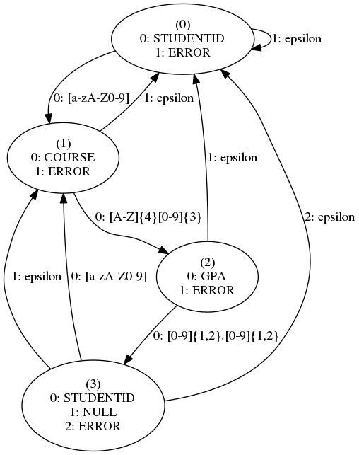

# Simple Finite Automata in Python



The file `simple_fa.py` contains a python program which defines a simple finite
automata, then simulates it for various inputs. The problem and a walkthrough
of the functionality of the program can be found in the comments of the
program.

## Demo

Run the demo with `make demo`.

This will execute `simple_fa.py` on each of the four sample files provided. The
first two show valid inputs, and the second two show invalid inputs.  A
graphical visualization of the automata will also be generated and saved in
`table.dot.pdf`.

The expected output from the demo is:

```
python3 ./simple_fa.py --verbose --visualize --input sample1.txt
0 --- ('jsmith' matched '[a-zA-Z0-9]' => STUDENTID) ---> 1
1 --- ('MATH101' matched '[A-Z]{4}[0-9]{3}' => COURSE) ---> 2
2 --- ('3.0' matched '[0-9]{1,2}\.[0-9]{1,2}' => GPA) ---> 3
3 --- ('' matched '' => NULL) ---> 1
1 --- ('ENGL101' matched '[A-Z]{4}[0-9]{3}' => COURSE) ---> 2
2 --- ('4.0' matched '[0-9]{1,2}\.[0-9]{1,2}' => GPA) ---> 3
Finished parsing a record: {'STUDENTID': ['jsmith'], 'GPA': ['3.0', '4.0'], 'COURSE': ['MATH101', 'ENGL101']}
- - - finished parsing, dump of records - - -
{'STUDENTID': ['jsmith'], 'GPA': ['3.0', '4.0'], 'COURSE': ['MATH101', 'ENGL101']}
python3 ./simple_fa.py --verbose --input sample2.txt
0 --- ('jsmith' matched '[a-zA-Z0-9]' => STUDENTID) ---> 1
1 --- ('MATH101' matched '[A-Z]{4}[0-9]{3}' => COURSE) ---> 2
2 --- ('3.0' matched '[0-9]{1,2}\.[0-9]{1,2}' => GPA) ---> 3
3 --- ('' matched '' => NULL) ---> 1
1 --- ('ENGL101' matched '[A-Z]{4}[0-9]{3}' => COURSE) ---> 2
2 --- ('4.0' matched '[0-9]{1,2}\.[0-9]{1,2}' => GPA) ---> 3
3 --- ('jdoe' matched '[a-zA-Z0-9]' => STUDENTID) ---> 1
Finished parsing a record: {'COURSE': ['MATH101', 'ENGL101'], 'GPA': ['3.0', '4.0'], 'STUDENTID': ['jsmith']}
1 --- ('CSCE145' matched '[A-Z]{4}[0-9]{3}' => COURSE) ---> 2
2 --- ('2.3' matched '[0-9]{1,2}\.[0-9]{1,2}' => GPA) ---> 3
3 --- ('jdeer' matched '[a-zA-Z0-9]' => STUDENTID) ---> 1
Finished parsing a record: {'COURSE': ['CSCE145'], 'GPA': ['2.3'], 'STUDENTID': ['jdoe']}
1 --- ('CSCE240' matched '[A-Z]{4}[0-9]{3}' => COURSE) ---> 2
2 --- ('3.6' matched '[0-9]{1,2}\.[0-9]{1,2}' => GPA) ---> 3
3 --- ('' matched '' => NULL) ---> 1
1 --- ('CSCE190' matched '[A-Z]{4}[0-9]{3}' => COURSE) ---> 2
2 --- ('4.0' matched '[0-9]{1,2}\.[0-9]{1,2}' => GPA) ---> 3
3 --- ('' matched '' => NULL) ---> 1
1 --- ('PHYS101' matched '[A-Z]{4}[0-9]{3}' => COURSE) ---> 2
2 --- ('3.8' matched '[0-9]{1,2}\.[0-9]{1,2}' => GPA) ---> 3
3 --- ('' matched '' => NULL) ---> 1
1 --- ('CHEM201' matched '[A-Z]{4}[0-9]{3}' => COURSE) ---> 2
2 --- ('1.2' matched '[0-9]{1,2}\.[0-9]{1,2}' => GPA) ---> 3
Finished parsing a record: {'COURSE': ['CSCE240', 'CSCE190', 'PHYS101', 'CHEM201'], 'GPA': ['3.6', '4.0', '3.8', '1.2'], 'STUDENTID': ['jdeer']}
- - - finished parsing, dump of records - - -
{'COURSE': ['MATH101', 'ENGL101'], 'GPA': ['3.0', '4.0'], 'STUDENTID': ['jsmith']}
{'COURSE': ['CSCE145'], 'GPA': ['2.3'], 'STUDENTID': ['jdoe']}
{'COURSE': ['CSCE240', 'CSCE190', 'PHYS101', 'CHEM201'], 'GPA': ['3.6', '4.0', '3.8', '1.2'], 'STUDENTID': ['jdeer']}
python3 ./simple_fa.py --verbose --input sample3.txt ||:
0 --- ('jdoe' matched '[a-zA-Z0-9]' => STUDENTID) ---> 1
1 --- ('jsmith' matched '' => ERROR) ---> 0
error transition while matching 'jsmith' which is 6a:73:6d:69:74:68 from state 1
other transitions were: [('[A-Z]{4}[0-9]{3}', 2, 'COURSE'), ('', 0, 'ERROR')]
FATAL: invalid transition while reading record 1
python3 ./simple_fa.py --verbose --input sample4.txt ||:
0 --- ('jsmith' matched '[a-zA-Z0-9]' => STUDENTID) ---> 1
1 --- ('CSCE145' matched '[A-Z]{4}[0-9]{3}' => COURSE) ---> 2
2 --- ('jdoe' matched '' => ERROR) ---> 0
error transition while matching 'jdoe' which is 6a:64:6f:65 from state 2
other transitions were: [('[0-9]{1,2}\\.[0-9]{1,2}', 3, 'GPA'), ('', 0, 'ERROR')]
FATAL: invalid transition while reading record 1
```
