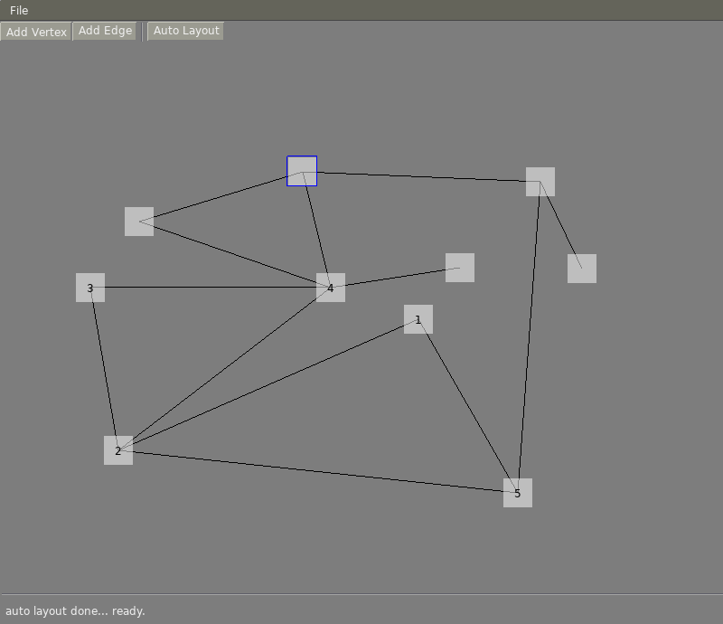

# Simple LibAgar Graph Editor

This is a simple program written to help me understand the most excellent
[LibAgar](http://libagar.org/) library. It was written against LibAgar 1.5.0.

A narrative description of the code is in [main.c](./main.c) is written inline
with the code as comments.

This program is mostly built around the
[`AG_Graph`](http://libagar.org/mdoc.cgi?man=AG_Graph.3) widget for displaying
and interacting with underacted graphs. It also shows how to use
[`AG_FileDlg`](http://libagar.org/mdoc.cgi?man=AG_FileDlg.3) to choose a file
to save.
